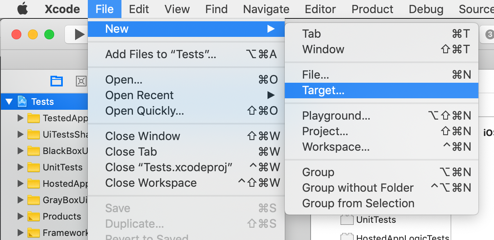
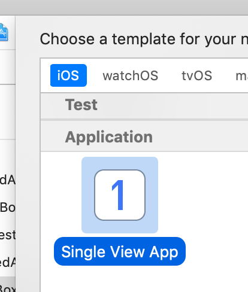
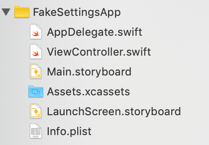
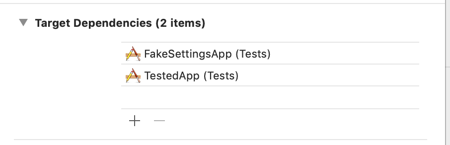

# About

This code simplifies making Fake Settings App for setting notifications permissions (via `FakeSettingsAppNotificationsApplicationPermissionSetter`)

## Installation

You need to create Application target with any name and bundle id. It can be really anything that:
- Calls a specific function (`FakeSettingsAppMain`).
- Has proper entitlements.
- Is a target dependency to your tests.

However, here is an example guide of how to make this app (steps may differ if you are using some other tools, e.g. if you don't use Cocoapods):

### Step 0

Add new target



### Step 1

Use simplest template (e.g.: Single View App), because all files of target will be replaced later.



### Step 2

Do not include any tests. Use Swift language.


### Step 3

You will see those files in your project:



### Step 4

Remove everything except `Info.plist`.

Add `main.swift`. Do not create bridging header if Xcode suggests you that. Contents:

```
import MixboxFakeSettingsAppMain

FakeSettingsAppMain(CommandLine.argc, CommandLine.unsafeArgv)
```

Add entitlements: [Entitlements.entitlements](Example/Entitlements.entitlements).

So you should have those files in your target:


### Step 5

Set entitlements for target in your project settings:


### Step 6

Make sure that those storyboards that you created and then deleted are not used in project:


### Step 7

Add FakeSettingApp to target dependencies:


Expected result:



### Step 8

Add to your Podfile (link it as you like:

```
target 'FakeSettingsApp' do
  pod 'MixboxFakeSettingsAppMain' # :path => '???' or '1.2.3' or :branch => 'master' or something else
end
```

`pod install`

### Step 9

In your tests DI container:

```
let applicationPermissionsSetterFactory = ApplicationPermissionsSetterFactory(
    notificationsApplicationPermissionSetterFactory: FakeSettingsAppNotificationsApplicationPermissionSetterFactory(
        fakeSettingsAppBundleId: "mixbox.Tests.FakeSettingsApp" // <--- bundle id you've chosen,
        testFailureRecorder: testFailureRecorder
    ),
    tccDbApplicationPermissionSetterFactory: tccDbApplicationPermissionSetterFactory // <--- is not a part of this documentation, other permissions
)

// This is an easy to use facade, to be used directly from tests.
permissions = applicationPermissionsSetterFactory.applicationPermissionsSetter(
    bundleId: XCUIApplication().bundleID,
    displayName: "My App", // <--- Name of your application (as on home screen)
    testFailureRecorder: testFailureRecorder
)
```

### Step 10

Done! Use it like this: `permissions.notifications.set(.allowed)`
